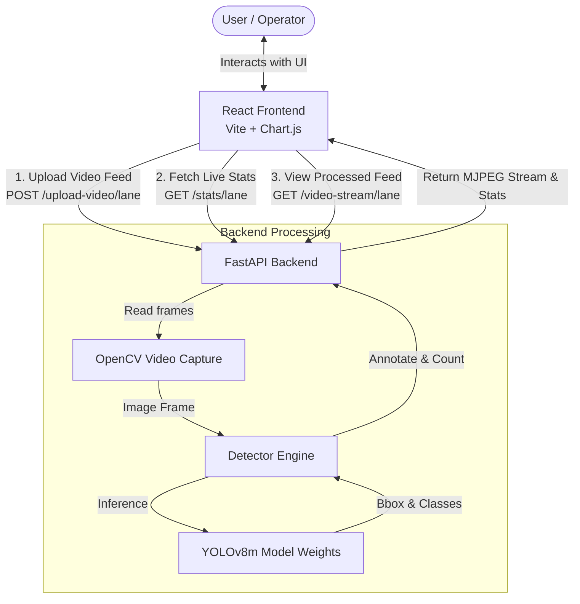

# 🚦 Smart Traffic AI

Smart Traffic AI is a real-time, computer-vision-powered traffic management and monitoring dashboard. By utilizing the **YOLOv8** object detection model and **FastAPI**, the system analyzes road traffic feeds to detect, count, and classify vehicles (cars, bikes, buses, and trucks). It then dynamically computes road density, yields recommended green light times, and offers automated lane priority recommendations alongside manual and emergency overrides.

The frontend is a premium, responsive dashboard built with **React**, **Vite**, and **Chart.js**, offering interactive graphs, live video stream feeds, and controls.

---

## 🏗️ System Architecture

The following diagram shows the data flow between the user interface, the FastAPI backend server, and the YOLOv8 computer vision detection engine:



---

## ✨ Key Features

- **Real-Time Vehicle Detection:** Dynamically detects, highlights, and counts cars, motorcycles/bikes, buses, and trucks using YOLOv8m.
- **Dynamic Density & Congestion Calculation:** Computes congestion density (0.0 to 1.0) per lane based on vehicle count.
- **Smart Signal Timing (Green ETA):** Calculates optimal green light times for each lane based on vehicle weightings (e.g., trucks and buses demand more green time than bikes).
- **AI-Powered Recommendation:** Automatically suggests which lane should receive the green light next based on real-time density.
- **Emergency & Pedestrian Controls:** Allows operator overrides (Ambulance prioritization and Pedestrian safety modes) to force signals red/green.
- **Rich Analytics Dashboard:** Visually displays comparisons, historical trends (last 30 snapshots), and AI priority scores using beautiful charts.
- **Session Event Logging:** Real-time log tracking lane status, critical density alerts, and signal updates.

---

## 🛠️ Tech Stack

### Frontend
- **Framework:** React 19 (Vite)
- **Styling:** Custom Vanilla CSS (Dark mode, glassmorphism, responsive grids)
- **Charts:** Chart.js with `react-chartjs-2`
- **Routing:** React Router DOM v7
- **API Client:** Axios

### Backend
- **Framework:** FastAPI (Python 3.10+)
- **Computer Vision:** OpenCV (`opencv-python`) & Ultralytics YOLOv8
- **Concurrency:** Threaded processing (one dedicated detection thread per lane)

---

## 📁 Repository Structure

```text
smart-traffic-ai/
├── backend/
│   ├── main.py                  # FastAPI server, endpoints, and multi-thread coordinator
│   ├── detector.py              # YOLOv8 inference, boundary line check, and frame annotation
│   ├── test_detection.py        # Local script to preview vehicle detection in OpenCV window
│   ├── demo.mp4                 # Sample traffic video used for testing/demo purposes
│   ├── requirements.txt         # Backend Python dependencies
│   ├── models/
│   │   └── yolov8m.pt           # YOLOv8 medium model weights (COCO pre-trained)
│   ├── uploads/                 # Uploaded lane video files
│   └── venv/                    # Python virtual environment
├── frontend/
│   ├── src/
│   │   ├── App.jsx              # Main React Application (Dashboard, Lane Page, charts)
│   │   ├── App.css              # Custom styling sheet (Aesthetics & Animations)
│   │   ├── index.css            # Base stylesheet & variables
│   │   └── main.jsx             # React application entrypoint
│   ├── package.json             # NPM dependencies & scripts
│   ├── vite.config.js           # Vite configuration
│   └── index.html               # Main HTML document template
├── model/
│   └── yolov8m.pt               # Secondary storage for model weights
└── README.md                    # Project documentation (This file)
```

---

## 🚦 How the Detection Logic Works

### 1. Spatial Filtering (Boundary Line)
To avoid detecting vehicles outside the intersection area, `detector.py` defines a crossing boundary line. Detections are filtered based on their bounding box centroid relative to this line.
- The crossing line starts at coordinate `(line_x, line_y)` and projects downwards at a specified `line_angle` with a length of `LINE_LENGTH` pixels.
- Only vehicles whose bounding box centroid `(cx, cy)` lies above this line are tracked and annotated.

```python
# From detector.py
def above_line(x, y):
    p1, p2 = get_line_points()
    return (p2[0] - p1[0]) * (y - p1[1]) - (p2[1] - p1[1]) * (x - p1[0]) > 0
```

### 2. Smart Green-Light Timing Calculation
The green light duration is calculated dynamically to prioritize heavier vehicles (which take longer to clear the intersection) and overall congestion:
$$\text{Green Time (seconds)} = 4 + (2 \times \text{bikes}) + (3 \times \text{cars}) + (4 \times \text{buses}) + (5 \times \text{trucks})$$

### 3. Density Estimation
Road density is calculated relative to a maximum capacity of 20 vehicles per lane:
$$\text{Density} = \min\left(1.0, \frac{\text{Total Vehicles}}{20}\right)$$

---

## 🚀 Getting Started

### Prerequisites
- **Python 3.10 or higher**
- **Node.js 18+ & npm**

---

### Backend Setup

1. Navigate to the `backend` directory:
   ```bash
   cd backend
   ```

2. Create a virtual environment and activate it:
   ```bash
   # Windows
   python -m venv venv
   .\venv\Scripts\activate

   # macOS/Linux
   python3 -m venv venv
   source venv/bin/activate
   ```

3. Install the required dependencies:
   ```bash
   pip install -r requirements.txt
   ```

4. *(Optional)* Verify your camera/detection setup locally:
   Running `test_detection.py` will open a local OpenCV window and display YOLO detections on the sample `demo.mp4` video:
   ```bash
   python test_detection.py
   ```

5. Run the FastAPI development server:
   ```bash
   uvicorn main:app --reload --port 8000
   ```
   The backend will be running at `http://127.0.0.1:8000`. You can view the interactive swagger docs at `http://127.0.0.1:8000/docs`.

---

### Frontend Setup

1. Navigate to the `frontend` directory:
   ```bash
   cd ../frontend
   ```

2. Install dependencies:
   ```bash
   npm install
   ```

3. Run the Vite development server:
   ```bash
   npm run dev
   ```
   The frontend will be available at `http://localhost:5173`.

---

## 🔌 API Endpoints

### Health Check
- **Endpoint:** `GET /health`
- **Description:** Verifies backend status and lists configured lanes.
- **Response:**
  ```json
  {
    "status": "ok",
    "lanes": ["lane1", "lane2", "lane3"]
  }
  ```

### Upload Video
- **Endpoint:** `POST /upload-video/{lane}`
- **Description:** Uploads a video file for a specific lane to initiate processing.
- **Parameters:** `lane` (string: `lane1`, `lane2`, or `lane3`)
- **Body:** `multipart/form-data` with `file` input.

### Live Stats
- **Endpoint:** `GET /stats/{lane}`
- **Description:** Returns the latest detected vehicle counts, calculated density, and green light duration.
- **Response:**
  ```json
  {
    "cars": 12,
    "bikes": 3,
    "buses": 1,
    "trucks": 0,
    "density": 0.8,
    "green_time": 48
  }
  ```

### Live Stream MJPEG
- **Endpoint:** `GET /video-stream/{lane}`
- **Description:** Returns an MJPEG stream of annotated frames with bounding boxes. Used directly in HTML `` source tags:
  ```html
  
  ```

---

## 🛡️ License
This project is open-source and available under the [MIT License](LICENSE).
